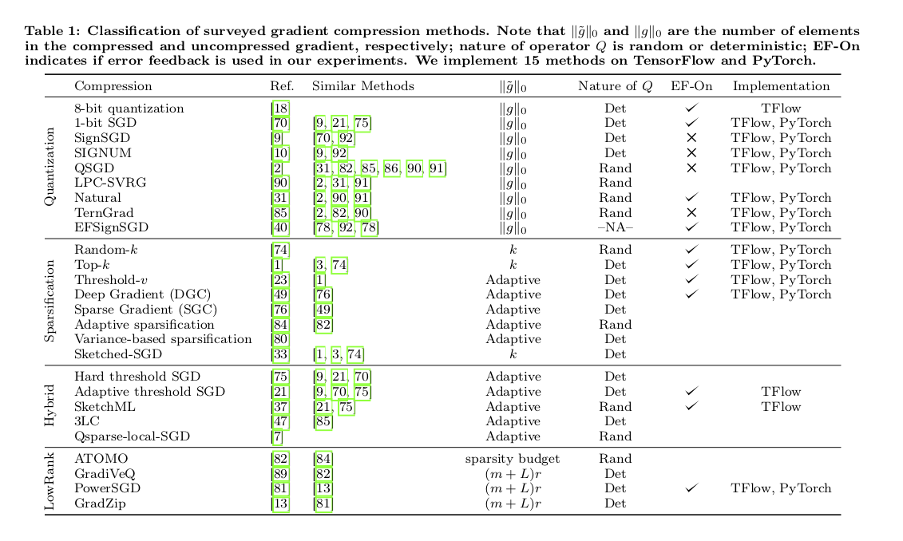
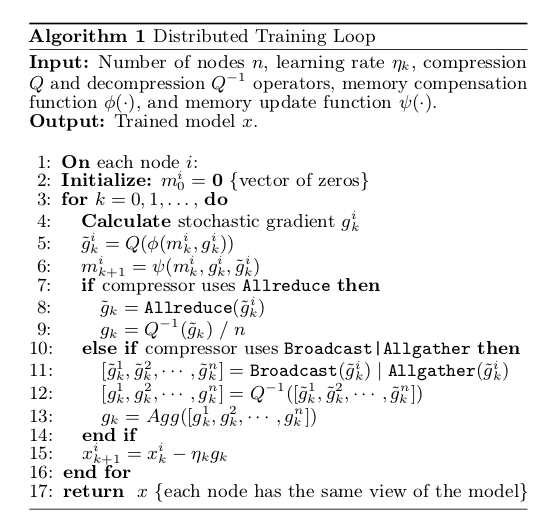

# Compressed Communication for Large-scale Distributed Deep Learning --- A Tutorial

## Tutorial Venue 
[**International Joint Conference on Artificial Intelliugence (IJCAI 2020)**](https://ijcai20.org/), Yokohoma, Japan

## Tutorial Dates 
11-13th July, 2020

## Presenters 
El Houcine Bergou, <houcine.bergou@kaust.edu.sa>

Aritra Dutta, <aritra.dutta@kaust.edu.sa>, [**Personal Website**](https://www.aritradutta.com/)

Panos Kalnis, <panos.kalnis@kaust.edu.sa>, [**Personal Website**](https://cloud.kaust.edu.sa/Pages/Kalnis.aspx)

[**King Abdullah University of Science and Technology (KAUST)**](https://www.kaust.edu.sa/en)

## Related Papers 

* [ **On the Discrepancy between the Theoretical Analysis and Practical Implementations of Compressed Communication for Distributed Deep Learning**](https://www.aritradutta.com/uploads/1/1/8/8/118819584/main.pdf), Aritra Dutta, El Houcine Bergou, Ahmed M. Abdelmoniem, Chen-Yu Ho, Atal Narayan Sahu, Marco Canini, and Panos Kalnis, In the proceedings of Thirty-Fourth AAAI Conference on Artificial Intelligence (AAAI-20), February 2020. 

* [**Compressed Communication for Distributed Deep Learning: Survey and Quantitative Evaluation**](https://repository.kaust.edu.sa/handle/10754/662495), Hang Xu, Chen-Yu Ho, Ahmed M. Abdelmoniem, Aritra Dutta, El Houcine Bergou, Konstantinos Karatsenidis, Marco Canini, and Panos Kalni, April 2020. 

## Description
We survey compressed communication methods for distributed deep learning and discuss the theoretical background, as well as practical deployment on TensorFlow and PyTorch. We also present quantitative comparison of the training speed and model accuracy of compressed communication methods on popular deep neural network models and datasets.

## Abstract 
Recent advances in machine learning and availability of huge corpus of digital data resulted in an explosive growth of DNN model sizes; consequently, the required computational resources have dramatically increased. As a result, distributed learning is becoming the de-facto norm. However, scaling various systems to support fast DNN training on large clusters of compute nodes, is  challenging. Recent works have identified that most distributed training workloads are *communication-bound*. To remedy the network bottleneck, various compression techniques emerged, including sparsification and quantization of the communicated gradients, as well as low-rank methods. Despite the potential gains, researchers and practitioners face a daunting task when choosing an appropriate compression technique. The reason is that training speed and model accuracy depend on multiple factors such as the actual framework used for the implementation, the communication library, the network bandwidth and the characteristics of the model, to name a few. 

In this tutorial, we will provide an overview of the state-of-the-art gradient compression methods for distributed deep learning. We will present the theoretical background and convergence guaranties of the most representative sparcification, quantization and low-rank compression methods. We will also discuss their practical implementation on TensorFlow and PyTorch with different communication libraries, such as Horovod, OpenMPI and NCCL. Additionally, we will present a quantitative comparison of the most popular gradient compression techniques in terms of training speed and model accuracy, for a variety of deep neural network models and datasets. We aim to provide a comprehensive theoretical and practical background that will allow researchers and practitioners to utilize the appropriate compression methods in their projects. 

## Outline of the tutorial

The tutorial is divided into several parts:

* **Part-1** [45min]. Motivation, history, and examples of compression methods: We will present an overview of the state-of-the-art in sparsification, quantization and low-rank methods used for gradient compression. We will describe in details influential methods for sparsification, quantization, and low-rank methods. 

    * We explain their theoretical guaranties in terms of complexity (i.e., convergence speed) and expected error. 
  
* **Part-2** [35min]. Practical implementation: We will discuss the implementation of these techniques and the challenges one can expect therein. We will  present programming APIs on TensorFlow and PyTorch that expose the necessary functions for implementing a wide variety of compressed communication methods. We will explain the various bottlenecks of practical implementations, such as the overheads of the compression/decompression algorithms and the effect of the underlying communication libraries such as Horovod, OpenMPI and NCCL. 

* **Part-3** [20min]. We will present a quantitative comparison of different methods on a variety of deep neural network models and across different datasets. We will demonstrate how parameters such as the number of compute nodes, network bandwidth, size and type of the model affect the training speed (in terms of throughput and actual wall-time) and training accuracy. We will also discuss the effect of acceleration techniques (e.g., momentum) and error correction methods (e.g., memory). 
    
 * **Part-4** [5min]. Interactive session with the audience. 

### What is distributed training? 

A distributed optimization problem minimizes a function 

where n is the number of workers. Each worker has a local copy of the model and has access to a partition of the training data. The workers jointly update the model parameters , where d corresponds to the number of parameters. Typically,  is an expectation function defined on a random variable that samples the data. This is also known as *distributed data-parallel training* as well. The following figure shows two instances of distributed training. 

[(a) Centralized distributed SGD setup by using n *workers* and unique *master/parameter* server. (b) An example of decentralized distributed SGD by using n machines forming a ring topology.] 

### How distributed training is performed? 

In the *distributed data-parallel training* each computing node or the worker has the local copy the DNN model. In the following Figure we show how a distributed training is performed at node i. 
[(a) DNN architecture at node i. (b) Gradient compression mechanism for one of the layer of a DNN.] 

### What is the bottleneck? What is the remedy? 

The parameters of modern DNNs belong to a high-dimensional space. As a result, the gradient vectors are high dimensional as well. As the DNN architechture shows, during the *backpropagation*, each node calculates the layer-wise gradient. However, these large gradient vectors need to be communicated among the workers and are exchanged through the network, and the aggregated values are sent back to the workers. This process is repeated unto convergence. The gradient communication indeed involves large amounts of data and the network bandwidth becomes the bottleneck. 

To alleviate this problem, many recent work propose to *compress* the communicated gradients to reduce the transferred data volume. **This tutorial focuses on *gradient compression***. We note that *parameter compression* is not our interest and orthogonal to our work. Formally, we define the gradient compression mechanism as follows:

      
  * Let  be the local gradient at worker  at level  of the DNN at iteration . 
  
  * Instead of transmitting  the worker sends  where  is a compression operator. 
  
  * The receiver decompresses the compressed gradient  where  is a decompression operator. 
  
  
For a formal definition of the compression operator , we refer the readers to [**this paper**.](https://www.aritradutta.com/uploads/1/1/8/8/118819584/main.pdf)

### Classification of ***Compression*** 

We identify four main classes of compressors in the literature: 
* **Quantization**---which reduces the number of bits of each element in the gradient tensor,
[**IEEE 754** datastructures: 32 bits, 16bits, and 8 bits flexpoint]   
* **Sparsification**---which transmits only a few elements per tensor,
[An example of Top-k sparsification]
* **Hybrid methods**---which combine quantization with sparsification, and 
* **Low-rank methods**---which decompose the gradient into low-rank matrices.

We refer the following table for an comprehensive overview of the gradient compression techniques. Although we do not claim it is exhaustive. 

### Is Layer-wise compression better than the full model compression? 

Compression methods can reduce communicated data-volume and they provide convergence guarantees (under some standard assumptions). However, there is a **discrepancy** between the theoretical analysis and practical implementation of existing compression methods. To the best of our knowledge, the theoretical analysis of every prior gradient compression method assume that the compression is applied to the gradient vector of the ***entire model***. However, from existing implementations perspective and experience with implementing compression methods, we observe that the compression is applied ***layer by layer*** to the DNN, (as illustrated in the next Figure) in all state-of-the-art deep learning toolkits, such as TensorFlow, Pytorch etc. to enforce *wait-free backpropagation* where the gradients of each layer are sent as soon as they are available.

[(a) Layer-wise training vs (b) entire model training]
 
 

* We established an unified convergence analysis for distributed SGD with **layer-wise, bidirectional**, compressed communication and it encompasses the majority of existing compression methods, both biased (e.g., Top k, Random k, signSGD) and unbiased (e.g., QSGD, TernGrad) in our recent [**AAAI 2020 paper**](https://www.aritradutta.com/uploads/1/1/8/8/118819584/main.pdf). We argue the **layer-wise** compression analysis is better in practice compare to the **entire-model** compression. Additionally, we provide both [**layerwise and full-model implementation**](https://github.com/sands-lab/layer-wise-aaai20).

## A Unified Framework

Now we propose a unified, general, compressed, communication-efficient SGD framework. 

## Selected References

* Alistarh, D.; Grubic, D.; Li, J.; Tomioka, R.; and Vojnovic, M., QSGD: Communication-Efficient SGD via Gradient Quantization and Encoding, In NeurIPS, 2017. 

* Alistarh, D.; Hoefler, T.; Johansson, M.; Konstantinov, N.; Khirirat, S.; and Renggli, C., The Convergence of Sparsified Gradient Methods, In NeurIPS, 2018.

* Bernstein, J.; Wang, Y.; Azizzadenesheli, K.; and Anandkumar, A., signSGD: Compressed Optimisation for Non-Convex
Problems, In ICML, 2018. 

* Dettmers, T.,  8-Bit Approximations for Parallelism in Deep Learning. In ICLR, 2016. 

* Lim, H.; Andersen, D. G.; and Kaminsky, M., 3LC:Lightweight and Effective Traffic Compression For Distributed
Machine Learning, In SysML, 2019.

* Seide, F.; Fu, H.; Droppo, J.; Li, G.; and Yu, D., 1-Bit Stochastic Gradient Descent and Application to Data-Parallel Distributed Training of Speech DNNs, In INTERSPEECH, 2014. 

* Wangni, J.; Wang, J.; Liu, J.; and Zhang, T., Gradient Sparsification for Communication-Efficient Distributed Optimization. In NeurIPS, 2018. 

* Wen, W.; Xu, C.; Yan, F.; Wu, C.; Wang, Y.; Chen, Y.; and Li, H., TernGrad: Ternary Gradients to Reduce Communication in
Distributed Deep Learning, In NeurIPS, 2017. 

* Aji, A. F. and Heafield, K., Sparse Communication forDistributed Gradient Descent. InProc. ofEMNLP-IJCNLP, 2017. 

* Wang, H.; Sievert, S.; Liu, S.; Charles, Z.; Papailiopoulos, D.; and Wright, S., ATOMO:Communication Efficient Learning via AtomicSparsification. In NeurIPS, 2018.

* Koloskova, A.; Stich, S.; and Jaggi, M., DecentralizedStochastic Optimization and Gossip Algorithms withCompressed Communication. In ICML, 2019. 
