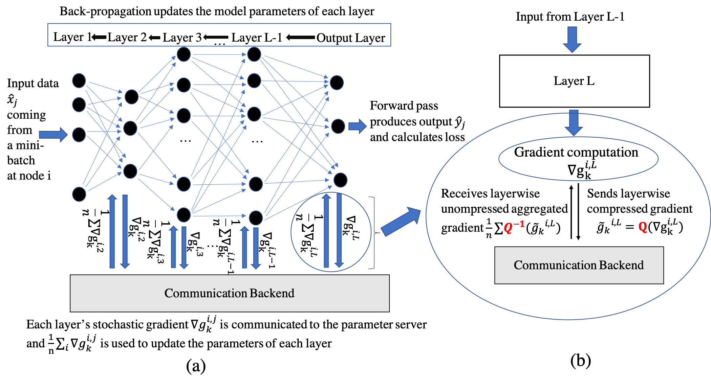
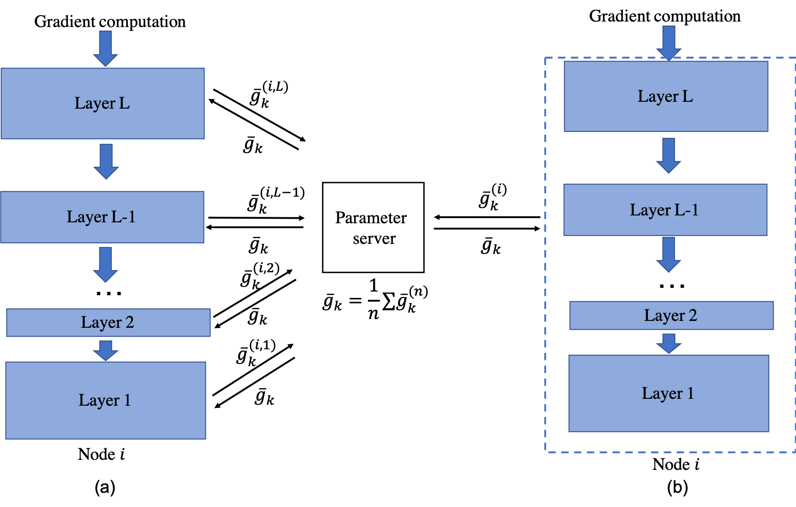

# Compressed Communication for Large-scale Distributed Deep Learning -- A Tutorial

## Tutorial Venue 
IJCAI 2020, Yokohoma, Japan

## Tutorial Dates 
11-13th July, 2020 

## Presenters 
El Houcine Bergou, <houcine.bergou@kaust.edu.sa>

Aritra Dutta, <aritra.dutta@kaust.edu.sa>, [Personal Website](https://www.aritradutta.com/)

Panos Kalnis, <panos.kalnis@kaust.edu.sa>

King Abdullah University of Science and Technology (KAUST)

## Description
We survey compressed communication methods for distributed deep learning and discuss the theoretical background, as well as practical deployment on TF and PT. We also present quantitative comparison of the training speed and model accuracy of compressed communication methods on popular deep neural network models and datasets.

## Abstract 
Recent advances in machine learning and availability of huge corpus of digital data resulted in an explosive growth of DNN model sizes; consequently, the required computational resources have dramatically increased. As a result, distributed learning is becoming the de-facto norm. However, scaling various systems to support fast DNN training on large clusters of compute nodes, is  challenging. Recent works have identified that most distributed training workloads are *communication-bound*. To remedy the network bottleneck, various compression techniques emerged, including sparsification and quantization of the communicated gradients, as well as low-rank methods. Despite the potential gains, researchers and practitioners face a daunting task when choosing an appropriate compression technique. The reason is that training speed and model accuracy depend on multiple factors such as the actual framework used for the implementation, the communication library, the network bandwidth and the characteristics of the model, to name a few. 

In this tutorial, we will provide an overview of the state-of-the-art gradient compression methods for distributed deep learning. We will present the theoretical background and convergence guaranties of the most representative sparcification, quantization and low-rank compression methods. We will also discuss their practical implementation on {\TF} and {\PT} with different communication libraries, such as Horovod, OpenMPI and NCCL. Additionally, we will present a quantitative comparison of the most popular gradient compression techniques in terms of training speed and model accuracy, for a variety of deep neural network models and datasets. We aim to provide a comprehensive theoretical and practical background that will allow researchers and practitioners to utilize the appropriate compression methods in their projects. 

### Outline of the tutorial

The tutorial is divided into several parts:

* **Part-1** [45min]. Motivation, history, and examples of compression methods: We will present an overview of the state-of-the-art in sparsification, quantization and low-rank methods used for gradient compression. We will describe in details influential methods for sparsification, quantization, and low-rank methods. 

    * We explain their theoretical guaranties in terms of complexity (i.e., convergence speed) and expected error. 
  
* **Part-2** [35min]. Practical implementation: We will discuss the implementation of these techniques and the challenges one can expect therein. We will  present programming APIs on {\TF} and {\PT} that expose the necessary functions for implementing a wide variety of compressed communication methods. We will explain the various bottlenecks of practical implementations, such as the overheads of the compression/decompression algorithms and the effect of the underlying communication libraries such as Horovod, OpenMPI and NCCL. 

* **Part-3** [20min]. We will present a quantitative comparison of different methods on a variety of deep neural network models and across different datasets. We will demonstrate how parameters such as the number of compute nodes, network bandwidth, size and type of the model affect the training speed (in terms of throughput and actual wall-time) and training accuracy. We will also discuss the effect of acceleration techniques (e.g., momentum) and error correction methods (e.g., memory). 
    
 * **Part-4** [5min]. Interactive session with the audience. 

### What is distributed training? 

 

### How distributed training is performed? 

 

We argue this is better in practice in our recent AAAI 2020 [paper](https://www.aritradutta.com/uploads/1/1/8/8/118819584/main.pdf). 
